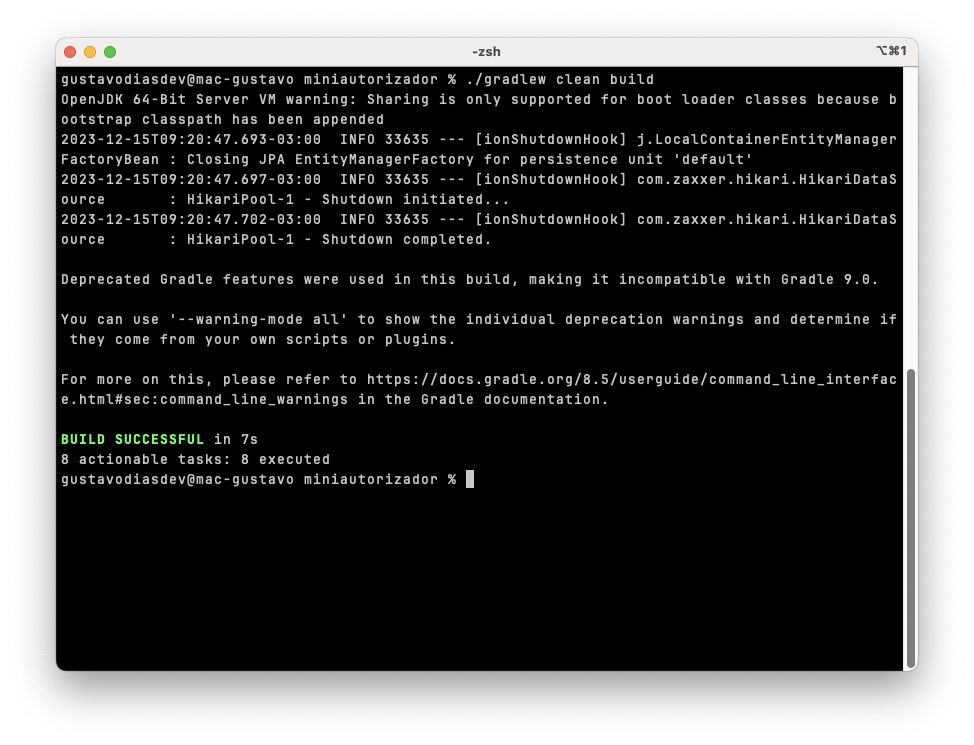
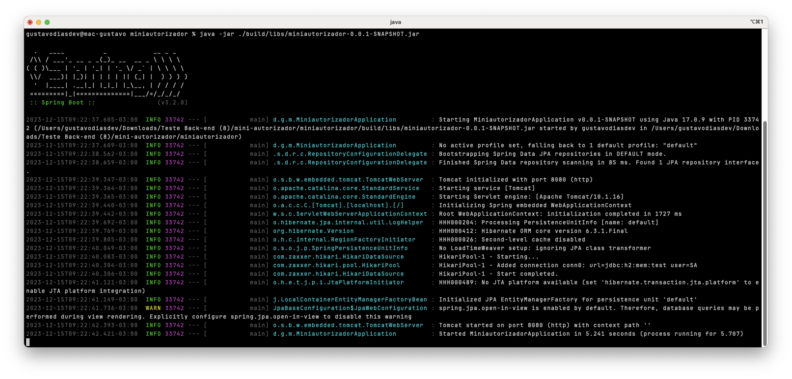
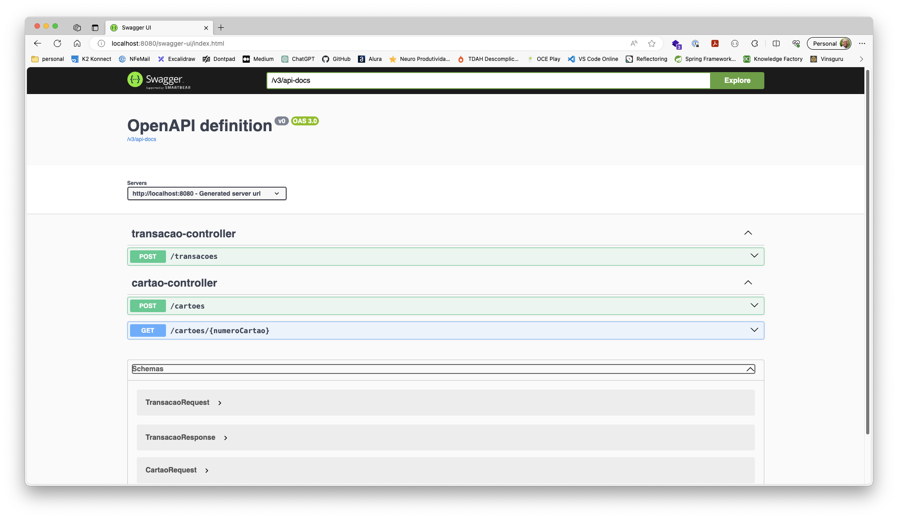

# API Mini Autorizador

### Sobre o projeto:
Projeto criado para criação das APIs em Java/Spring.

### Como o projeto está configurado:
O projeto está estruturado nos seguintes pacotes(packages):

Pacotes:
- config (classes de configurações)
- controller (classes de controle para expor as APIs)
- service (classes de regras negociais)
- model (classes de modelo, entidades, enuns, dtos ...)
- repository (classe de tratamento com o banco de dados)

O projeto está configurado para rodar com DB H2(local), assim que subir a aplicação será criado as tabelas do pacote
model que estão anotadas com a @Entity, nas configurações está sendo usado o ddl-auto setado update onde
vai ser verificado se já existe tal tabela, caso positivo irá apenas atualizar se houver mudanças e caso negativo
irá criar a nova tabela na base de dados.

### Como subir o projeto:
Tendo o Java 17 instalado na máquina, basta apenas clonar o projeto e executar os passos abaixo.

Faça o clone do repositório em alguma pasta, após isso acesse a pasta e digite:

```
./gradlew clean build
```


Após o build execute o seguinte comando:

```
java -jar ./build/libs/miniautorizador-0.0.1-SNAPSHOT.jar
```

    

Se tudo ocorreu bem, o projeto subiu na porta 8081, que foi configurado no application.properties



Prontinho! Só testar agora e ver os erros acontecerem. rsrs


